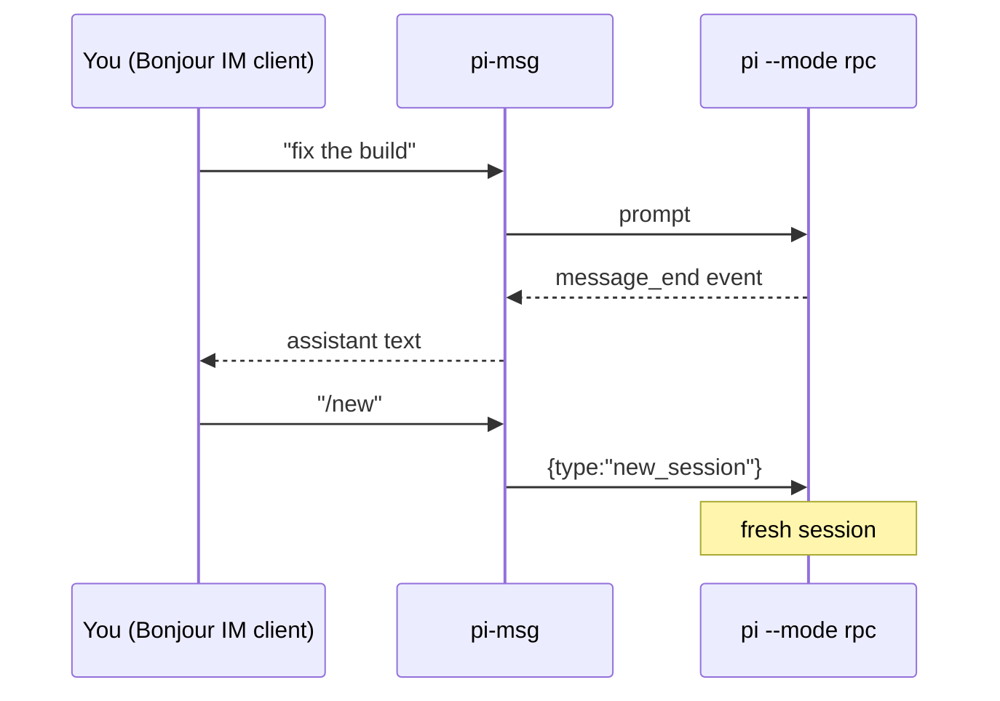

# pi-msg

> Fork of [zachpmanson/pi-msg](https://github.com/zachpmanson/pi-msg/tree/main), modified
> to connect **directly to the owner's Bonjour IM client** — serverless
> messaging (XEP-0174). No XMPP server anywhere, no password auth.

Drive the [Pi](https://pi.dev) coding agent **entirely from a chat client** — a
**direct 1:1 peer-to-peer stream** with a Bonjour IM user (e.g. Adium or
Messages) discovered over mDNS/DNS-SD (`_presence._tcp`). pi-msg never contacts
an XMPP/Jabber server: it advertises its own Bonjour IM instance, connects
directly to the owner's advertised instance, and relays your messages to the
agent and back.

`pi-msg` launches `pi --mode rpc`, then bridges Pi's JSONL event stream to XMPP
(via [mellium.im/xmpp](https://mellium.im/xmpp)): the assistant's replies are relayed
to you as chat messages, and your chat messages drive the agent — plain prompts **and**
slash commands, exactly as if you'd typed them into Pi locally.

Because it runs Pi in RPC mode, commands like `/new` work over chat (an earlier
in-process-extension version couldn't do this — `sendUserMessage` can't invoke Pi's
command layer).

## How it works



Each finished **assistant message** → sent to you as chat. Agent state shows on
three independent signals: a **typing indicator** while a reply is actually being
written, presence **`<show>`** (`dnd` while busy, available when idle), and a
presence **status** label of the current activity (`thinking…`, `running: <cmd>`,
`replying…`, `retrying…`, `listening`) — carried both in-stream and as the mDNS
TXT `status=` key your client's roster shows. When a run settles with **no** text
you get a `✅ done (no reply) — your turn` nudge.

Messages you send are acknowledged with **read receipts** — XEP-0184 delivery
receipts and XEP-0333 chat markers (`displayed`) — when the agent takes them in, if
your client requests them.

Your chat messages → routed to Pi:

| You send | Becomes |
| --- | --- |
| plain text | a prompt to the agent |
| `/skill:name …`, `/template …`, any extension command | a prompt (Pi expands/runs it) |
| `/new` | `new_session` (fresh session; connection stays up) |
| `/compact [instructions]` | `compact` |
| `/model <provider/id>` or `/model <search>` | `set_model` |
| `/think <off\|low\|medium\|high\|…>` | `set_thinking_level` |
| `/abort` (or `/stop`) | `abort` |
| `/dump` (or `/dump pretty`) | send the session transcript to the owner — raw JSONL, or `pretty` for indented per-record JSON (no LLM turn) |
| `/quit` (or `/exit`) | shut down the bridge and Pi |

## Configuration

Create `~/.config/pi-msg/config.json` (override the path with `PI_MSG_CONFIG`), then
`chmod 600` it:

```json
{
  "accounts": {
    "default": {
      "jid": "pi@mbpro.local",
      "owner": "you@mbpro.local",
      "alias": "Pi",
      "model": "anthropic/claude-sonnet-latest",
      "workdir": "/path/to/your/project"
    }
  }
}
```

Per-account fields:

| field | required | default | notes |
| --- | --- | --- | --- |
| `jid` | yes | — | bare JID of the bot account (e.g. `pi@mbpro.local`); the identity pi-msg advertises over Bonjour and presents in the peer stream |
| `owner` | yes | — | the human this account relays to; the **only** JID whose messages drive the agent (XEP-0174 is strictly 1:1) |
| `bonjourService` | no | `_presence._tcp` | DNS-SD service type browsed to find the owner's Bonjour IM instance |
| `bonjourName` | no | — | narrow discovery to a service instance whose name contains this string (for LANs with several Bonjour IM users) |
| `discoverTimeout` | no | `10s` | how long each Bonjour discovery attempt waits for the owner's instance (Go duration) |
| `model` | no | Pi's default | model pattern passed to `pi --model` |
| `workdir` | no | current dir | working directory for the agent (also where Pi discovers `AGENTS.md`/`CLAUDE.md`) |
| `reactions` | no | `false` | XEP-0444 emoji reactions on owner messages: lifecycle → 👀 picked up / ✅ done / ⛔ aborted, and enables the agent-driven `send_reaction` tool (see [Agent tools](#agent-tools)) |
| `avatar` | no | — | path to a local image (PNG/JPEG/GIF) whose SHA-1 hash is advertised as the bot's XEP-0153 photo hash (`phsh` key) in the Bonjour TXT record |
| `alias` | no | — | display alias advertised as the XEP-0174 `nick` key in the Bonjour TXT record; shown as the contact's name in Adium and other Bonjour IM clients |

Old server-only keys (`room`, `resource`, `nick`, `roomTrigger`, `uploadService`,
`pingInterval`, …) are silently ignored, so pre-existing configs keep loading.

Multiple accounts: add more keys under `accounts`; `default` is used unless you set
`PI_MSG_ACCOUNT=<name>`.

## Bonjour (serverless XEP-0174) only

pi-msg connects **only** directly to the owner's Bonjour IM client. No XMPP
server, no account on a domain, no password. There is no SASL, STARTTLS,
resource binding, or roster — just a raw `<stream:stream>` between two peers
over TCP.

- **Discover** — on every (re)connect it browses `_presence._tcp` for an
  instance whose name is the owner's bare JID (escaped per DNS-SD rules, e.g.
  `you\@mbpro.local`) and dials its address:port. The port comes from the
  XEP-0174 TXT `port=` key when present, else the SRV record, else the default
  **5298**. Discovery is fresh each attempt, so a client that comes online
  later on the LAN is picked up.
- **Advertise** — pi-msg registers its *own* `_presence._tcp` instance (its JID,
  escaped) with TXT keys `txtvers=1`, `port=` (its actual listen port, preferring
  5298 but falling back to an ephemeral port if one is taken), `status=` (live
  availability), and `phsh=` when an avatar is configured. Your client shows the
  bot online and can initiate a stream to it; outbound messages from pi-msg use
  the session it dialed, which is bidirectional.
- **Listen** — the advertised listener accepts inbound serverless connections
  from your client and treats every accepted message the same as an outbound
  session's.

See who's online and what config to write with:

```bash
just discover        # or: ./pi-msg --discover
```

which lists every discovered service (e.g. `crn@mbpro  mbpro.local:5298`) and
prints the `jid`/`owner` to put in config.

Requirements:

- **mDNS must work on the host** — macOS resolves and advertises Bonjour out of
  the box; Linux needs `avahi` (or `systemd-resolved` with mDNS enabled).
- **A Bonjour IM client (Adium / Messages / similar) must be online** for the
  owner, advertising under their JID over `_presence._tcp`.
- The bot and owner JIDs are like `pi@<host>` — the domain is the machine's
  local hostname, **not** a registered internet domain.

## Agent tools

Beyond reply text, the agent gets structured **tools** (registered by a small companion
extension that pi-msg loads into `pi --mode rpc`, which relays each call back to pi-msg to
perform the XMPP action):

| Tool | What it does | Enabled when |
| --- | --- | --- |
| `send_reaction` | React to a message with an emoji (XEP-0444) | `reactions` is on |

Serverless messaging has no XEP-0363 upload component, so the old `send_file`
tool is gone; files travel as chat text only.

## Run

```bash
go build -o pi-msg . && ./pi-msg     # from the repo
```

Set `PI_MSG_DEBUG=1` to print connection/status/stderr diagnostics. On startup the bot
simply comes **online** in your roster (presence `listening`); on shutdown or a pi crash it
goes **offline** with a `<status>` describing why and when — pi-msg no longer posts chat
banners for these lifecycle events.

Requirements: Go ≥ 1.26 (to build), and a `pi` on `PATH` that's logged into a provider
(`pi` → `/login`).

## Notes

- Pi runs tools autonomously (no built-in approval prompts). If some other extension
  raises a dialog (`select`/`confirm`/`input`/`editor`), pi-msg auto-dismisses it
  (nobody's at the TUI) and tells you over chat — so approval-gated tools are declined
  over the bridge.
- The connection is a **raw peer stream over plain TCP on your LAN** — there is no
  encryption layer (serverless messaging predates TLS and doesn't use it). Trust your
  LAN.
